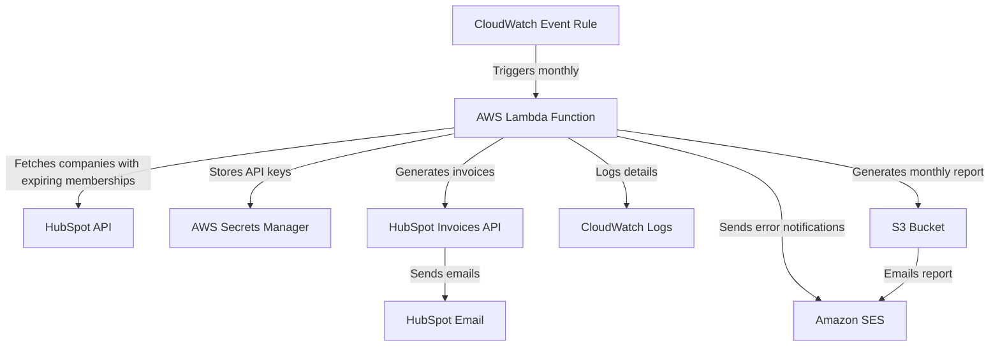

# HubSpot Invoicing System Architecture Plan

## System Overview

We'll build a serverless solution that integrates with HubSpot to automatically generate and email invoices for companies with expiring memberships. The system will run monthly, identify companies with memberships expiring at the end of the month, generate itemized invoices based on membership types and their specific pricing structures, and email them to primary contacts.

## Architecture Diagram



## Membership Types and Pricing Structure

The system will handle three distinct membership types, each with its own pricing structure:

### 1. Distributor Membership
- Base fee: $929
- Additional charge: $70 per territory
- Territory calculation:
  * Sum of US States, Canadian Provinces, and Non-North American territories
  * Total invoice = $929 + ($70 × number of territories)

### 2. Manufacturer Membership
- Five pricing tiers based on sales volume:
  * $1,500 — Sales up to $5,000,000
  * $3,500 — Sales from $5,000,001 to $10,000,000
  * $5,000 — Sales from $10,000,001 to $20,000,000
  * $7,500 — Sales from $20,000,001 to $40,000,000
  * $10,000 — Sales over $40,000,001

### 3. Service Provider Membership
- Flat rate: $1,250

## Component Details

### 1. AWS Lambda Function (Node.js)
- **Purpose**: Core processing logic for identifying expiring memberships and generating invoices
- **Runtime**: Node.js 18.x
- **Memory**: 512MB (adjustable based on performance needs)
- **Timeout**: 5 minutes (adjustable based on volume)
- **Key Dependencies**:
  - HubSpot Node.js SDK
  - AWS SDK for JavaScript

### 2. CloudWatch Events
- **Purpose**: Schedule the Lambda function to run monthly
- **Schedule**: Cron expression to run on a specific day each month (e.g., 25th day to process end-of-month renewals)
- **Configuration**: Configurable through environment variables

### 3. AWS Secrets Manager
- **Purpose**: Securely store HubSpot API keys and other sensitive information
- **Secrets**:
  - HubSpot API Key
  - HubSpot Access Token (if using OAuth)
  - Email configuration (if using SES)

### 4. Amazon S3
- **Purpose**: Store monthly invoice summary reports
- **Structure**:
  - Folder for each month/year
  - CSV or JSON files containing invoice details

### 5. Amazon SES (Simple Email Service)
- **Purpose**: Send error notifications and monthly reports
- **Configuration**:
  - Verified sender email
  - Templates for error notifications

### 6. CloudWatch Logs
- **Purpose**: Detailed logging for monitoring and troubleshooting
- **Log Groups**:
  - Lambda function logs
  - Error logs
  - Performance metrics

## Data Flow

### Monthly Invoice Generation Process

1. **Trigger**: CloudWatch Event triggers the Lambda function on the scheduled day
2. **Authentication**:
   - Lambda retrieves HubSpot API credentials from Secrets Manager
3. **Data Retrieval**:
   - Query HubSpot API to identify companies with "Next Renewal Date" property indicating renewal at the end of the current month
   - For each company, retrieve:
     - Company details (name, ID)
     - Membership type (Distributor, Manufacturer, or Service Provider)
     - Required properties for pricing calculation:
       * For Distributors: US States, Canadian Provinces, Non-North American territories
       * For Manufacturers: Sales volume or membership tier level
     - Primary contact information
4. **Price Calculation**:
   - For each company, calculate the appropriate invoice amount based on membership type:
     - **Distributor**: $929 + ($70 × total territories)
     - **Manufacturer**: Determine tier based on sales volume and apply appropriate fee
     - **Service Provider**: Flat $1,250 fee
5. **Invoice Generation**:
   - For each company with an expiring membership:
     - Create invoice using HubSpot Invoices API
     - Add appropriate HubSpot products to each invoice
     - For Distributor Territories: either add individual $70 territory products or create custom line item
     - Set due date and payment terms
6. **Data Update**:
   - Write total invoiced amount to membership dues property for record-keeping
7. **Email Delivery**:
   - Use HubSpot's email capabilities to send invoices to primary contacts
   - Track email opens and interactions within HubSpot
8. **Reporting**:
   - Generate a summary report of all invoices created
   - Store report in S3
   - Email report to finance team using SES
9. **Error Handling**:
   - Log detailed error information to CloudWatch
   - Send error notifications via SES if process fails

## Error Handling Strategy

1. **API Failures**:
   - Implement retry logic with exponential backoff for transient errors
   - Log detailed error information including request/response data
   - Continue processing other companies if one fails

2. **Data Validation**:
   - Validate company data before invoice generation
   - Check for missing required properties (membership type, territories for distributors, etc.)
   - Skip companies with incomplete/invalid data
   - Log validation failures with company IDs for manual follow-up

3. **Calculation Validation**:
   - Implement bounds checking for calculated values
   - Flag unusually high or low invoice amounts for review
   - Log detailed calculation steps for audit purposes

4. **Notification System**:
   - Send immediate email alerts for critical failures
   - Include error details and troubleshooting steps in notifications

## Monitoring and Reporting

1. **CloudWatch Metrics**:
   - Track number of companies processed
   - Track number of successful/failed invoice generations
   - Track execution time and resource usage
   - Track metrics by membership type

2. **Monthly Summary Report**:
   - List of all companies invoiced
   - Invoice amounts by membership type
   - Failed invoice generations
   - Total invoice amount
   - Breakdown of distributor territory calculations

3. **CloudWatch Alarms**:
   - Set up alarms for Lambda errors
   - Set up alarms for high failure rates

## Implementation Plan

### Phase 1: Setup and Configuration
1. Create AWS resources (Lambda, S3, CloudWatch Events)
2. Configure Secrets Manager with HubSpot API credentials
3. Set up basic logging and monitoring

### Phase 2: Core Functionality
1. Implement HubSpot API integration to fetch companies with expiring memberships
2. Implement pricing calculation logic for each membership type
3. Implement invoice generation logic using HubSpot Invoices API
4. Implement email delivery through HubSpot

### Phase 3: Error Handling and Reporting
1. Implement comprehensive error handling
2. Create monthly summary report generation
3. Set up error notifications

### Phase 4: Testing and Optimization
1. Test with sample data for each membership type
2. Verify calculation logic with finance team
3. Optimize Lambda performance
4. Fine-tune error handling and retry logic

## Code Structure

```
/
├── src/
│   ├── index.js                # Lambda entry point
│   ├── hubspot/
│   │   ├── client.js           # HubSpot API client setup
│   │   ├── companies.js        # Company data retrieval
│   │   ├── contacts.js         # Contact data operations
│   │   └── invoices.js         # Invoice generation
│   ├── pricing/
│   │   ├── distributor.js      # Distributor pricing calculation
│   │   ├── manufacturer.js     # Manufacturer tier pricing
│   │   └── serviceProvider.js  # Service provider pricing
│   ├── utils/
│   │   ├── logger.js           # Logging utilities
│   │   ├── error-handler.js    # Error handling
│   │   └── reporting.js        # Report generation
│   └── config/
│       └── index.js            # Configuration management
├── tests/
│   ├── unit/                   # Unit tests
│   │   ├── pricing/            # Tests for pricing calculations
│   │   └── hubspot/            # Tests for HubSpot integration
│   └── integration/            # Integration tests
├── package.json
├── serverless.yml             # Infrastructure as code (optional)
└── README.md
```

## Security Considerations

1. **API Key Management**:
   - Store all credentials in AWS Secrets Manager
   - Rotate keys regularly

2. **Data Protection**:
   - Encrypt sensitive data in transit and at rest
   - Implement least privilege access for Lambda IAM role

3. **Audit Logging**:
   - Log all API calls and data access
   - Implement request IDs for traceability

## Scalability Considerations

1. **Lambda Concurrency**:
   - Set appropriate concurrency limits
   - Implement batching for large numbers of companies

2. **API Rate Limiting**:
   - Implement throttling to respect HubSpot API limits
   - Add backoff strategy for rate limit errors

3. **Performance Optimization**:
   - Cache membership tier details
   - Optimize HubSpot API queries

## Future Enhancements

1. **Manual Trigger**:
   - Add API Gateway endpoint to manually trigger the process
   - Implement filtering options for manual triggers

2. **Dashboard**:
   - Create a simple web dashboard for monitoring and manual operations
   - Visualize invoice generation metrics

3. **Advanced Reporting**:
   - Implement more detailed financial reports
   - Add trend analysis for membership renewals

4. **Review Workflow**:
   - Add optional human review step before sending invoices
   - Implement approval workflow for invoices above certain thresholds